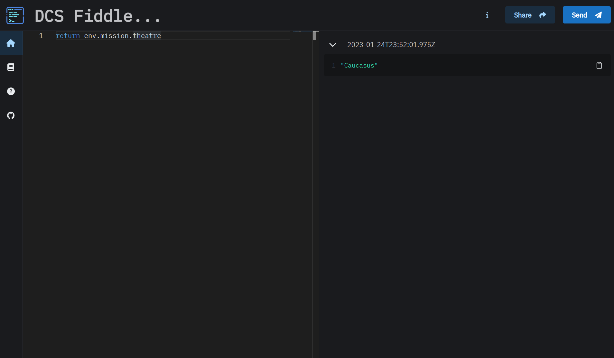

# DCS Fiddle

This website is a text editor and console.

Pressing the `Send` button will submit the command to DCS.

Pressing the `Share` button will encode your script into a shareable link to share your scripts with friends.

Visit the site

https://dcsfiddle.pages.dev/

Visit the docs for full documentation

https://dcsfiddle.pages.dev/docs

## About

This site sends a GET request to the sim over http when the http server is enabled.

See the technical information inside the Docs for more info on the architecture.

## Server Installation

The HTTP server is a downloadable lua script. You will need to create a mission to load and run it.

See the Getting started guide inside the documentation for more information.

https://dcsfiddle.pages.dev/docs

## Disclaimer

> The Software and code samples available on this website are provided "as is" without warranty of any kind, either express or implied. Use at your own risk. By pressing proceed you understand these risks.
