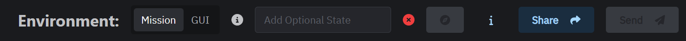
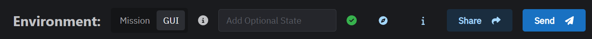

## Getting Started

The combined process involves

- Downloading a `dcs-fiddle-server.lua` into `%userprofile%\Saved Games\DCS\Scripts\Hooks\dcs-fiddle-server.lua` file.
- Removing the `sanitize` in the mission scripting environment for `require` and `package`.

## Installation

> By downloading this file you agree that its usage is at your own risk.
>
> Modification of this file is not permitted.
>
> It is configured as to not expose the system outside the localhost network.
>
> Modification may result in you unknowingly allowing someone to compromise your PC.

Download: [dcs-fiddle-server.lua](/dcs-fiddle-server.lua)

Copy the script file to your Saved games folder, i.e.

```shell
%userprofile%\Saved Games\DCS\Scripts\Hooks\dcs-fiddle-server.lua
```

> THE FILE NAME MUST BE `dcs-fiddle-server.lua`

## De-Sanitize

With the script installed head to the DCS installation directory, and into the scripts folder and open the mission scripting file.

```shell
%programfiles%\Eagle Dynamics\DCS World\Scripts\MissionScripting.lua
```

Comment out the two lines as highlighted to make the `require` and `package` modules available

```lua
-- Initialization script for the Mission lua Environment (SSE)
dofile('Scripts/ScriptingSystem.lua')

-- Sanitize Mission Scripting environment
-- This makes unavailable some unsecure functions.
-- Mission downloaded from server to client may contain potentialy harmful lua code that may use these functions.
-- You can remove the code below and make availble these functions at your own risk.

local function sanitizeModule(name)
    _G[name] = nil
    package.loaded[name] = nil
end

do
    sanitizeModule('os')
    sanitizeModule('io')
    sanitizeModule('lfs')
[++]    -- _G['require'] = nil
    _G['loadlib'] = nil
[++]    -- _G['package'] = nil
end
```

> LUA uses two dashes as a line comment, put those at the start of the line
> Changes to this file are lost on each update of DCS

## Verifying 

With the sim running refresh the site, it should now connect if you have the `GUI` environment selected.

When a mission is running it should also have the `Mission` environment connected.

A red cross indicates a bad connection.



A green cross indicates a good connection.


